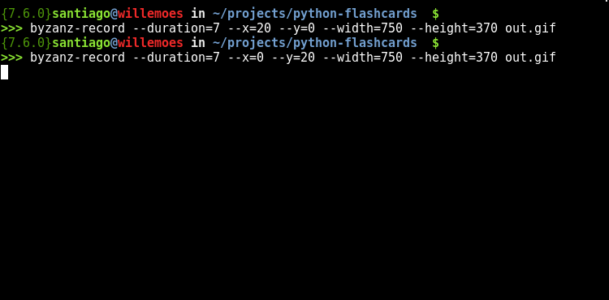

========
Overview
========

.. start-badges

.. list-table::
    :stub-columns: 1

    * - docs
      - |docs|
    * - tests
      - | |travis|
        | |codecov|
    * - package
      - | |version| |wheel| |supported-versions| |supported-implementations|
        | |commits-since|

.. |docs| image:: https://readthedocs.org/projects/python-flashcards/badge/?style=flat
    :target: https://readthedocs.org/projects/python-flashcards
    :alt: Documentation Status

.. |travis| image:: https://travis-ci.org/Woile/flashcards.svg?branch=master
    :alt: Travis-CI Build Status
    :target: https://travis-ci.org/Woile/flashcards

.. |codecov| image:: https://codecov.io/github/Woile/flashcards/coverage.svg?branch=master
    :alt: Coverage Status
    :target: https://codecov.io/github/Woile/flashcards

.. |version| image:: https://img.shields.io/pypi/v/flashcards.svg
    :alt: PyPI Package latest release
    :target: https://pypi.python.org/pypi/flashcards

.. |commits-since| image:: https://img.shields.io/github/commits-since/woile/flashcards/v0.1.0.svg
    :alt: Commits since latest release
    :target: https://github.com/woile/flashcards/compare/v0.1.0...master

.. |wheel| image:: https://img.shields.io/pypi/wheel/flashcards.svg
    :alt: PyPI Wheel
    :target: https://pypi.python.org/pypi/flashcards

.. |supported-versions| image:: https://img.shields.io/pypi/pyversions/python-flashcards.svg
    :alt: Supported versions
    :target: https://pypi.python.org/pypi/python-flashcards

.. |supported-implementations| image:: https://img.shields.io/pypi/implementation/python-flashcards.svg
    :alt: Supported implementations
    :target: https://pypi.python.org/pypi/python-flashcards

.. end-badges

small cli tool to study using fl

* Free software: BSD license

Installation
============

The module still does not support python2, so if python3 is not your default, use pip3

::

    pip3 install python-flashcards

What flashcards are
===================

  A flashcard or flash card is a set of cards bearing information, as words or numbers, on either or both sides, used in classroom drills or in private study. One writes a question on a card and an answer overleaf. `[Wikipedia] <https://en.wikipedia.org/wiki/Flashcard>`_

How does this work
==================

``python-flashcards`` is a small tool, which receives cards from a ``YAML`` file, and shows them in a random order so you can practice.

``YAML`` format:

.. code-block:: yaml

  -
    topic: The topic I will say out loud
    content: The information I'll check after saying out loud what I know
    keywords: reference, words
  -
    topic: Python
    content: Is a widely used high-level programming language for general-purpose programming,
      created by Guido van Rossum and first released in 1991.
    keywords: programming, language

Being ``keyword`` the only optional.

Usage
=====

Let's supouse ``anatomy.yaml`` is your file with information related to anatomy.

::

    flashcards anatomy.yaml

If you want the cards in order:

::

    flashcards --ordered meds.yaml

For more help:

::

    flashcards -h

Documentation
=============

https://python-flashcards.readthedocs.io/

Development
===========

To run the all tests run::

    tox

Note, to combine the coverage data from all the tox environments run:

.. list-table::
    :widths: 10 90
    :stub-columns: 1

    - - Windows
      - ::

            set PYTEST_ADDOPTS=--cov-append
            tox

    - - Other
      - ::

            PYTEST_ADDOPTS=--cov-append tox
